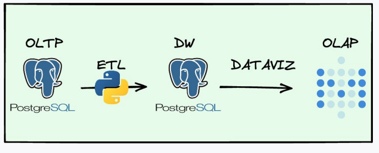
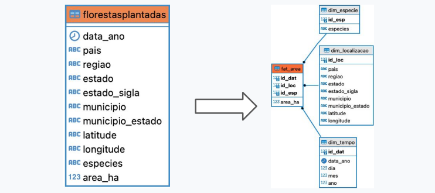
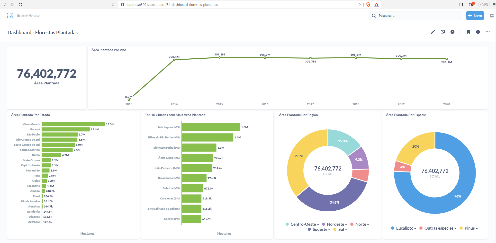

# Projeto Prático Engenharia de Dados e Visualização de Dados

A proposta é criar um projeto de Big Data com ingestão e visualização de dados ponta a ponta.

## Problema de negócio
* Criar um dashboard sobre florestas plantadas no Brasil, com informações sobre a área total plantada, com possibilidade de análise por ano, por localidade e por espécie de árvore plantada.
* Criar um datalake no repositório de objetos, para armezenar os arquivos originais e os arquivos de processamento dos dados.
* É necessário manter um histórico dos dados originais obtidos, para que o passado possa ser validado.
* Armazenar os dados originais em um banco de dados PostreSQL.
* Criar um datawarehouse no banco de dados PostgreSQL utilizando o esquema estrela (Star Schema)
* Armazenar os dados de florestas plantadas no datawarehouse considerando as dimensões de tempo, localização e espécie de árvore

# Fonte de dados

Os dados utilizados mantidos e disponibilizados pelo Sistama Nacional de Informações Florestais (SNIF),
e pode ser baixado no link:

https://snif.florestal.gov.br/images/xls/recursos_florestais/RF_FPlantada_IBGE-PEVS_SIDRA_Brasil_2013-2020_16-08-2022_DadosAbertos.csv

## Tecnologias utilizadas
* Python => Para criação do pipeline de dados e rotinas de ETL
* Airflow => Para orquestração do pipeline de dados
* MinIO => Utilizado como repositório de arquivos para as rotinas de processamento e o datalake
* Spark => Para processamento distribuído do processos de ETL
* PostgreSQL => Para armazenar os dados processados e dados do datawarehouse
* Metabase => Para construção do dashboard consumindo os dados do datawarehouse
* Docker => Para gerenciamento da infraestrutura dos serviços
* Git => Para gerenciamento do código fonte
* DBeaver => Para consulta e visualização dos dados no PostgreSQL

# Arquitetura

# Modelagem dos dados

# Fluxo de trabalho
* Fazer  o download do arquivo disponível na plataforma SNIF
* Salvar o arquivo baixado no bucket <code>snif-florestal-raw</code> do MinIO 
no diretório <code>/year={yyyy}/month={mm}/day={dd}/downloaded</code> a data do download do arquivo.
* Processar os arquivos baixados, e salvar no bucket <code>snif-florestal-stage</code> no formato *.csv e 
salvar os dados dos arquivos *.csv no formato *.parquet no bucket <code>snif-florestal-analytics</code>
Após o processamento mover o arquivo original para o bucket <code>snif-florestal-raw</code> no diretório <code>/year={yyyy}/month={mm}/day={dd}/processed</code>
* Salvar todos os dados contidos nos arquivos *.parquet do datalake no bucket <code>snif-florestal-analytics</code> 
no banco de dados <code>snif_florestal</code> na tabela <code>floresta_plantada</code> do PostgreSQL.
* Extrair os dados do banco de dados <code>snif_florestal</code> na tabela <code>floresta_plantada</code> do PostgreSQL
e transformá-los para o esquema estrela (Star Schema) e salvar no banco dataware house.
* Criar um dashboard no Metabase para visualização dos dados, exibindo:
  * A área total plantada em hectares
  * A área total plantada por ano
  * A área total plantada por UF
  * As 10 cidades com mais área total plantada
  * A área total plantada por região 
  * A área total plantada por espécie

# Dashboard Florestas Plantadas

